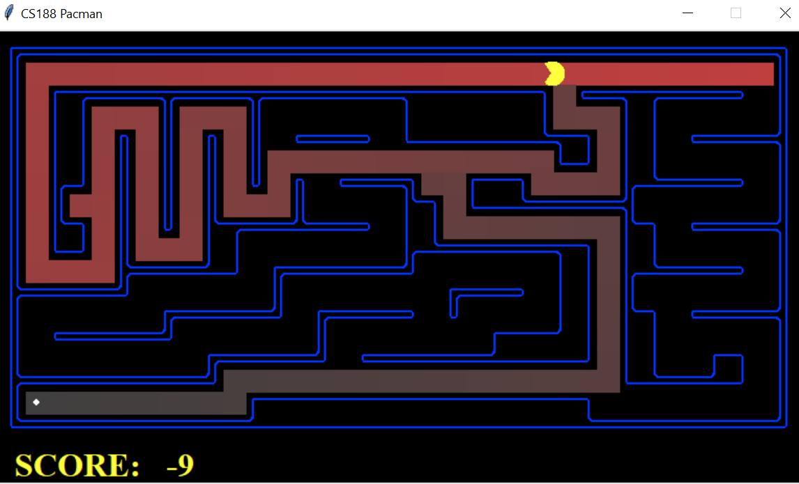
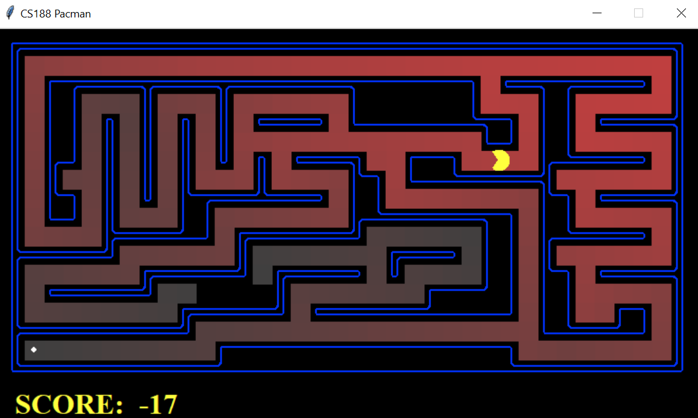

# Artificial-Intelligence


## 1. Pacman 

In this project, Pacman agent will find paths thoughout his maze world, both to reach a particular location and to collect food essentials. We used Python implementation of general search algorithms and applied them to Pacman scenarios. 


### A) Search Algortihms Used


| Algortihms | Application     | Description                |
| :-------- | :------- | :------------------------- |
| `depthFirstSearch` | `Done` | **Required**. Search the deepest nodes in the search tree first. |
| `breadthFirstSearch` | `Done` | **Required**. Search the shallowest nodes in the search tree first. |
| `uniformCostSearch` | `Pending` | **Required**. Search the node of least total cost first. |
| `nullHeuristic` | `Pending` | **Required**. A heuristic function estimates the cost from the current state to the nearest goal in the provided SearchProblem. |
| `aStarSearch` | `Pending` | **Required**. Search the node that has the lowest combined cost and heuristic first. |

### B) ScreenShots
#### -> DFS - Medium Maze


#### -> BFS - Medium Maze


### C) Running Tests

To run tests, see `commands.txt`.

Example:

To play a game of Pacman type the following command line: 

```bash
  python pacman.py 
```

To perform DFS on different maze size, type the following command line:

```bash
  python pacman.py -l tinyMaze -p SearchAgent
  python pacman.py -l mediumMaze -p SearchAgent
  python pacman.py -l bigMaze -z .5 -p SearchAgent
```

